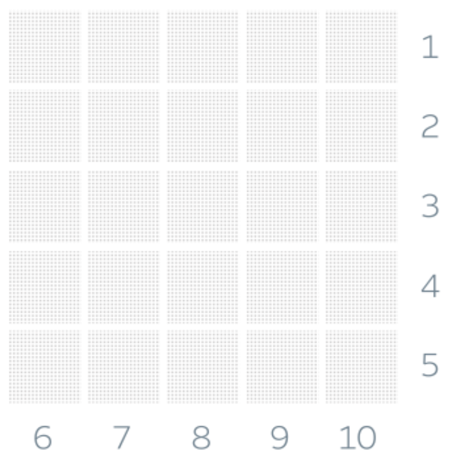
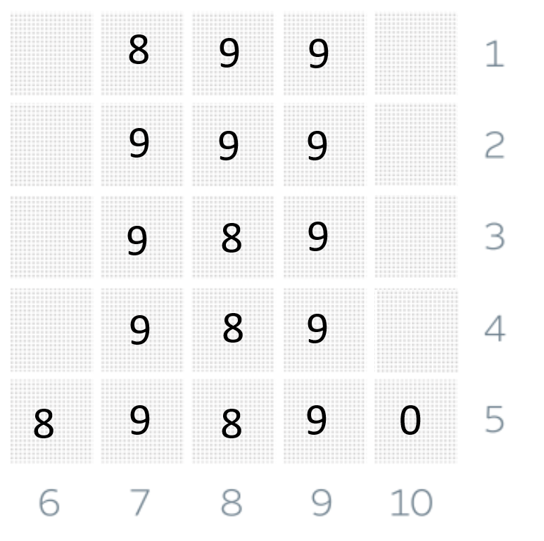
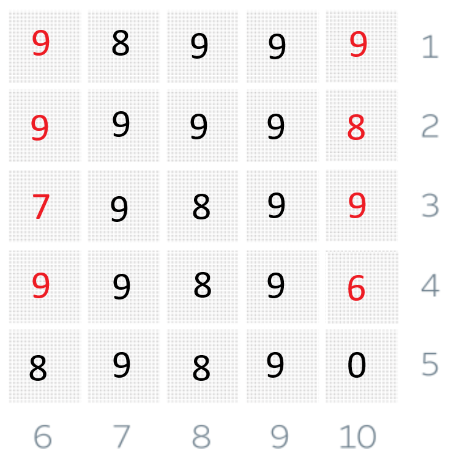

# Solving Sum-Of-Squares

This was my very first Jane Street puzzle that I decided to solve and was a really a rich experience in trying to learn
on how do large quant firms desing and expect the solvers to approach.

One of the very best lesson that I learned from here is that:

- Do not run towards finding the correct solution, focus on finding the correct path. This may seem obvious but this is
an important lesson that you need to remember when solving
- Try to understand with logic and intuition on what can work and cannot work. Try to see if your logic stands against
edge cases.

# Table of Contents

- [Solving Sum-Of-Squares](#solving-sum-of-squares)
- [Table of Contents](#table-of-contents)
- [Approach on Solution](#approach-on-solution)
  - [How to approach constraints](#how-to-approach-constraints)
  - [Precomputation required for solution](#precomputation-required-for-solution)
  - [Partial Solving the problem](#partial-solving-the-problem)
- [Full Solution](#full-solution)


# Approach on Solution

First it is important to have a grid ready that we will start filling based on the constraints and mathematical property
of divisions. Here is the raw grid without any of the contents in it:



As you can see from the image that there are multiple divisors associated with each row and column to divide the numbers
that would be generated if we were to concatenate them together in left to right and top to bottom respectively, however
the constraints in the problems are given such that we have to maximize the sum of each of the digits.

Here is the key to this - if we had no constraints on the number then the maximum sum we could obtain was `9*25=225`, as
with each of the constraints we end up having to decrease some number for each of the constraints - thus our goal now is
to reduce this "reduction" value on the final sum.


## How to approach constraints

To approach this idea of constraints we have to understand how each of the divisor will effect on how many cells so here
is a nice table that tells how many cells are affected by each of the divisors:

<table>
    <tr>
        <th>Divisor</th>
        <th>Total number of cells affected</th>
        <th>Comment</th>
    </tr>
    <tr>
        <td>10</td>
        <td>1</td>
        <td>The Division rule of 10 states last digit must be zero</td>
    </tr>
    <tr>
        <td>9</td>
        <td>5</td>
        <td>The Division rule of 9 states sum of digits must be divisible by 9</td>
    </tr>
    <tr>
        <td>8</td>
        <td>3</td>
        <td>The Division rule of 8 states last 3 digits must be divisible by 8</td>
    </tr>
    <tr>
        <td>7</td>
        <td>5</td>
        <td>This would require manual effort to generate the ideal number</td>
    </tr>
    <tr>
        <td>6</td>
        <td>5</td>
        <td>The number generated must be divisible by both 2 and 3</td>
    </tr>
    <tr>
        <td>5</td>
        <td>1</td>
        <td>The last digit of number must be 5 or 0</td>
    </tr>
    <tr>
        <td>4</td>
        <td>2</td>
        <td>The last two digits of the number must be divisble by 4</td>
    </tr>
    <tr>
        <td>3</td>
        <td>5</td>
        <td>The sum of digits must be divisble by 3</td>
    </tr>
    <tr>
        <td>2</td>
        <td>1</td>
        <td>The last digit must be divisble by 2</td>
    </tr>
    <tr>
        <td>1</td>
        <td>0</td>
        <td>Always divisble</td>
    </tr>
</table>


## Precomputation required for solution

It is clear that based on the rules we can see for divisibility some manual precomputation effort is required to have 
some of the cell contents to be fixed beforehand. A thing to take care here would be the fact that our goal is still to
maximize the sum of the digits, therefore our choices for the contents of cell must be done so that we can maximize the
final sum.

Here is a small script in C++ that would take multiples of the number configured in constants and then group each of the
number based on the sum of digits which are then ordered in decreasing order:

```cpp
#include <functional>
#include <iostream>
#include <map>
#include <vector>

constexpr int UPPER_LIMIT = 10000;
constexpr int MULTIPLE = 8; // change this for different numbers
constexpr int BASE_10 = 10;

int digitSum(int x) {
    int sum{0};
    while (x != 0) {
        sum += (x % BASE_10);
        x = x/BASE_10;
    }
    return sum;
}

int main() {
    std::map<int, std::vector<int>, std::greater<int>> m;
    for (int i{0}; i<UPPER_LIMIT; i+=MULTIPLE) {
        m[digitSum(i)].emplace_back(i);
    }
    for (const auto& [k, v]: m) {
        std::cout << k << ": [";
        for (const auto& i: v) {
            std::cout << i << ",";
        } 
        std::cout << "]\n"; 
    }
    return 0;
}
```

Running the above program gives us the number that has the maximum digit sum while also being divisible by the divisor 
mentioned in the variable `MULTIPLE`. Here are some of the key numbers required:

```text
For 7: 89999
For 8: 99888, in fact the 3 digit number divisble by 8 that has maximum sum is 888
For 9: 99999
```

## Partial Solving the problem

Using the above information we can partialy solve our problem matrix as following:



So how did we end up solving most of the problem? Here comes the way we ordered our constraints and their application!

A key insight that we can gain while solving this is based on the fact that certain cells need to have their value 
precomputed so that we have easier time trying to figure out values for the other cells based on already available info.

Here is an example: The column that would be divisble by `10` forces only certain value to be present in the bottom 
right cell - `0` which also takes care of divisibility with `5` for the row as well.

SO - here is an interesting question how would you go ahead filling up the values? My thought process: Larger divisor
first. Why? Because the way I saw this is that the larger the divisor the more number of cells it would end up 
influencing in the final values. This means we would first process each of the column values first so that we can end up
changing values for the row later.

So first we entered the value for 10, 9, 8, 7 and 6 - to as many values that we can precompute for! which gives us the
above solution. 

But why not solve 6 completely as well? That's because the same reason we are not solving the rightmost cell as well as 
these values are influenced by the divisor for each of the row and selecting the constraints whose value we would tackle
first will be based on information taken from the input of various different rows as well.


# Full Solution

This section handles the remaining part to solve - The rows and here again we will use the largest divisor first, 
however we should first focus on on the 3 values: 4, 2 and 1 as these values have certainity in their information given.

First we will go with 4 as the tens digit is already 9 and we have to maximize our sum we will place 6 in its row and we
will do the same with row divisble by two where we would place 8 as the last digit of the number formed to maximize the
sum. For one we just have to place 9 as the maximum possible value possible.

Now comes the curious case of 3 where the sum of digits must be divisble by 3 and is also influencing the contents of
column divisble by 6 - and both of them have the same problem what happens to the maximum possible sum for a number 
divisble by 3 but it also has a 8 in it.

Let us start with the sum as following: `9 + 9 + 9 + 9 + 8 = 44` as we can see that the sum is not divisble by 3 we can
also see that remainder is 2 thus we have two options - reduce two 9s to 8s or reduce one 9 to 7. Here comes the idea on
how to position our number that will still keep our sum to the maximum.

If we are to go with option one where we replace two 9s with 8s the sum contribution from row divisble by 6 and row 
divisble by 3 will be sum of both, which would be `42*2` in our case minus the intersection point. As we have only two 
places that are free to be changed for 3, both of the 8s must be placed there leading to sum contribution being: 
`42*2 - 8 = 76`.

However if we are to use 7 to replace one 9 and that is placed at the intersection point of row divisble by 6 and row
divisble by 3, we get the sum as `42*2 - 7 = 77`. Thus we get the following solution:



Thus our solution pair is: `(205,9899999998798999989689890)`
